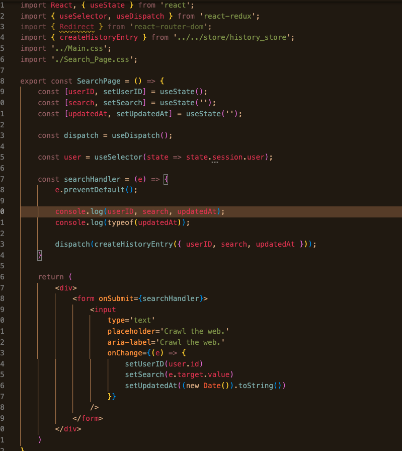
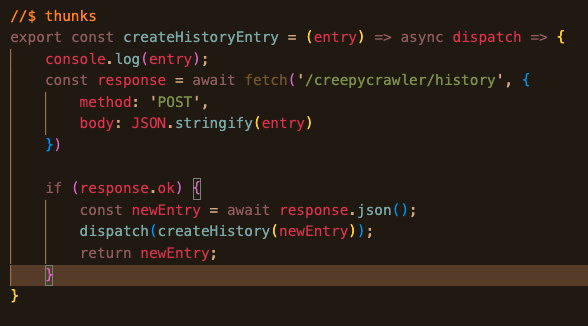
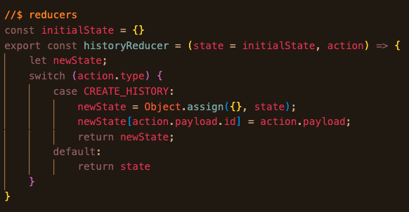
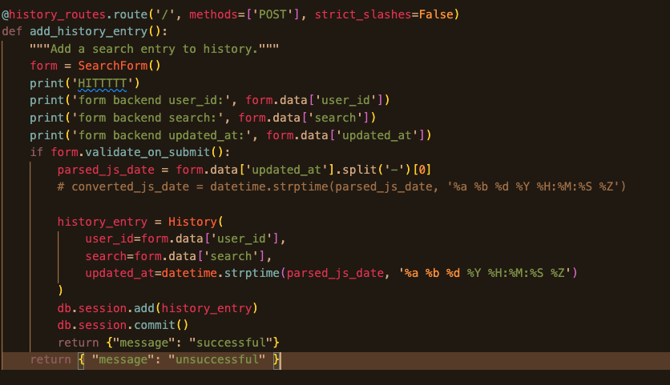

**Error Type:** Semantic

**Top-Level Description**: My search is not being logged to my database's history table.

[bug manifestation](#bug-manifestation)
[possible bug origin](#possible-bug-origin)

### Data Flow

#### Frontend
The entry is made here
*frontend_display*

I send the relevant data from my search form's onChange event and dispatch in my searchHandler function
*frontend_search_page_component*

It's sent to my store and processed by my thunk and reducer
*frontend_history_thunk*

*frontend_history_reducer*

By this point, I'm receiving all the values I expect. Initially, I faced an issue with new Date() unexpectedly returning an object albeit appearing as a string; however, that was rectified. Here is what my console looks like:
*frontend_console*

#### Backend

##### bug manifestation
This route is hit.
*backend_history_routes*

The print statement doesn't make it inside of the conditional, as evinced in my terminal.
*backend_terminal*

This makes me think that the form may not be validating as expected.

##### possible bug origin
The route summons the following form
*backend_search_form*

here are relevant snippets from my database tables
*backend_histories_table*

*backend_users_table*

