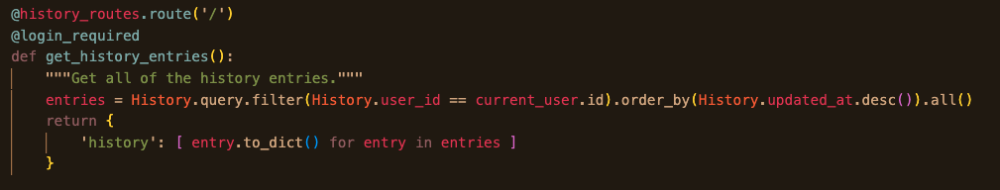
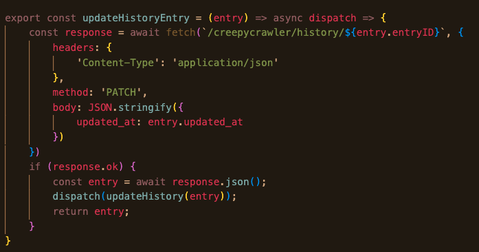
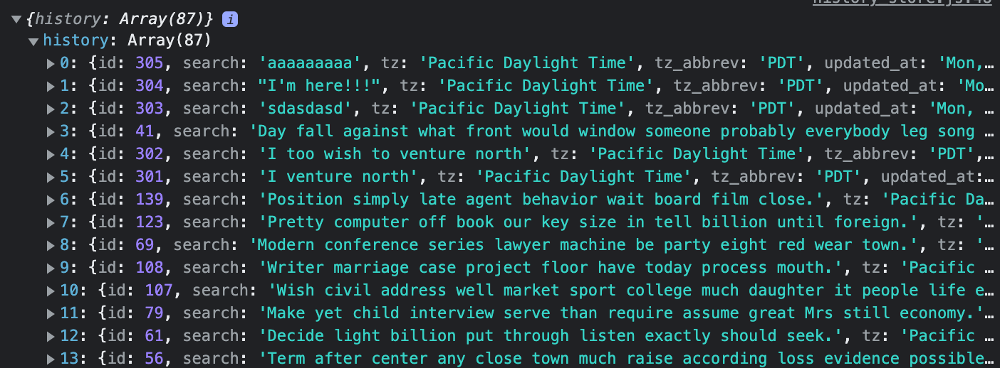
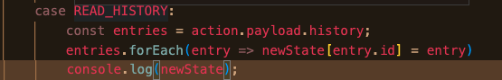
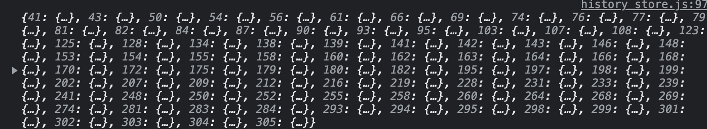
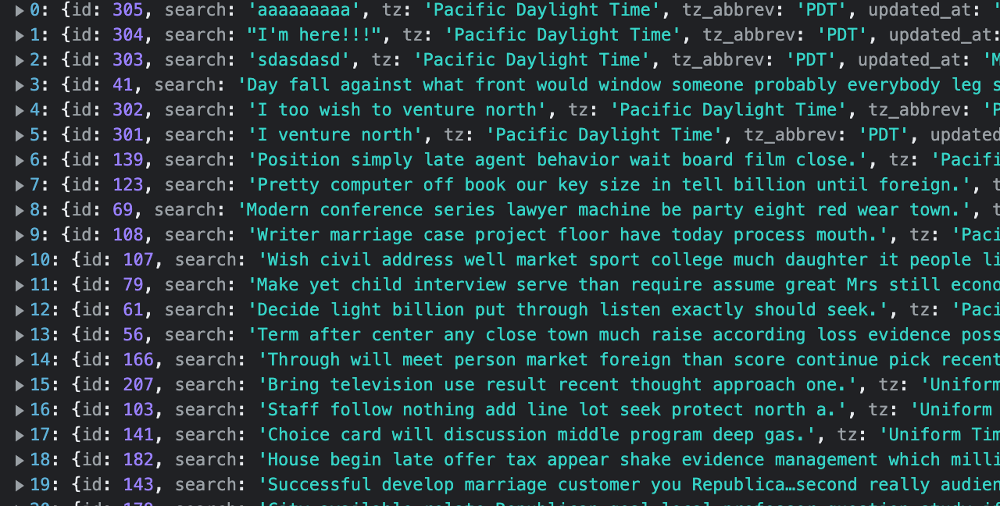

Flow of data:

**backend routes**

At this point, my object is this in the backend:

It's a list of 87 entries ordered how I would like. It is then parsed by json on the frontend here:

The order and functional structure is maintained, the only visible difference being that the indices are visible in the frontend console:

Where the data finally loses its order is in the READ_HISTORY case of my history reducer:
 
The data is now ordered by index:

It will also appear as such in my state.

The conundrum is the following:
I need to have my indices match the ids for the sake of O(1) lookup time for my patch and delete operations. So, albeit I have been able to maintain the order of the data by spreading entries and newState in my READ_HISTORY case:  `return {...entries,...newState}` instead of using a forEach method, the result is only beneficial for my read operation. As you'll see in the following picture, the re-indexing kills any instant lookup time chances:

I want instant lookup time as well as the order coming from my backend. Preferably, I would like to maintain this order rather than recreate it on the other side, through some frontend sort; however, I'm open to anything that allows me to attain this functionality without dramatically hurting the performance of my other operations. 